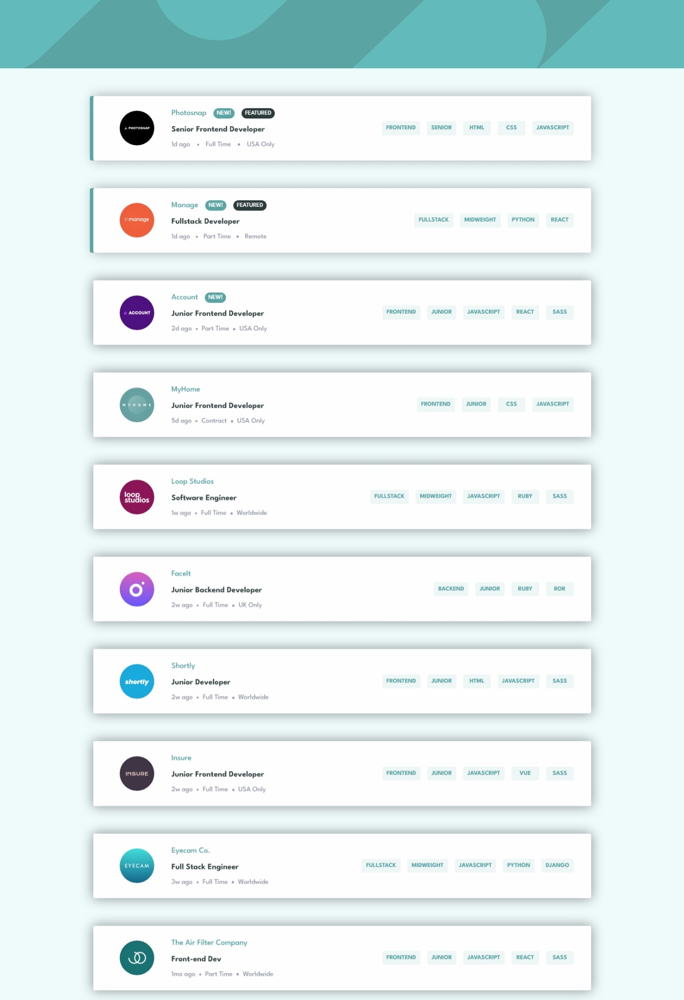

# Frontend Mentor - Job listings with filtering solution

This is a solution to the [Job listings with filtering challenge on Frontend Mentor](https://www.frontendmentor.io/challenges/job-listings-with-filtering-ivstIPCt).

## Table of contents

- [Overview](#overview)
  - [The challenge](#the-challenge)
  - [Screenshot](#screenshot)
  - [Links](#links)
- [My process](#my-process)
  - [Built with](#built-with)
  - [What I learned](#what-i-learned)
  - [Continued development](#continued-development)
- [Author](#author)

## Overview

### The challenge

Users should be able to:

- View the optimal layout for the site depending on their device's screen size
- See hover states for all interactive elements on the page
- Filter job listings based on the categories

### Screenshot

### Links

- Solution URL: [Solution](https://github.com/shalash23/static-job)
- Live Site URL: [Live Site](https://lucky-hamster-fcd25d.netlify.app/)

## My process

### Built with

- React
- Material UI 5
- Framer Motion
- Vite

### What I learned

Definitely how to implement succesfully framer motion with MUI components. This was definitely tricky at first, but once you get the hang of it, it becomes very simple.

### Continued development

More Material UI training.

## Author

- Frontend Mentor - [@shalash23](https://www.frontendmentor.io/profile/shalash23)
